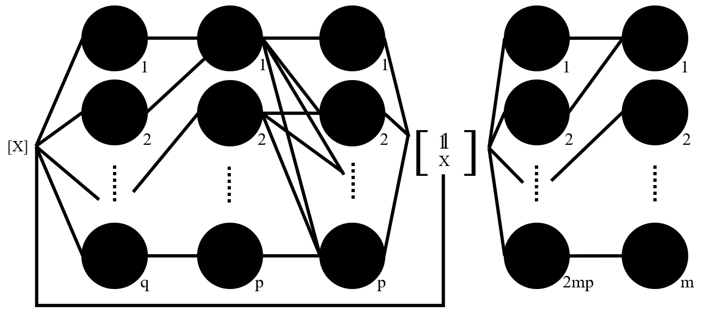

# Y-wise Affine Neural Networks (YANNs)



Tutorial and reference implementation of **YANNs** for exact representations of piecewise affine functions and model predictive control (MPC) policies.

This reposity includes tutorial materials and research demonstrations of building and applying YANNs.

---

## Features
* YANN implementation from scratch
* Accuracy verification with mp-MPC
* Educational / tutorial friendly codebase

---

## Quick Start

### Run in Google Colab

[](https://colab.research.google.com/github/Innovation-Driven-Sustainable-Systems/yanns/blob/main/tutorial/Tutorial_Colab.ipynb)


### Conda Environment

```bash
git clone https://github.com/Innovation-Driven-Sustainable-Systems/yanns.git
cd yanns
conda env create -f environment.yml
conda activate yanns
jupyter lab
```

Then open:

```text
tutorial/Tutorial.ipynb
```

---

## Citation
If you use this repository or build on this work, please cite:
```bibtex
@article{BRANIFF2026109610,
title = {Reinforcement learning-based control via Y-wise Affine Neural Networks (YANNs)},
author = {Austin Braniff and Yuhe Tian},
journal = {Computers & Chemical Engineering},
volume = {209},
pages = {109610},
year = {2026},
issn = {0098-1354},
doi = {https://doi.org/10.1016/j.compchemeng.2026.109610},
url = {https://www.sciencedirect.com/science/article/pii/S0098135426000633}
}
```
with the full paper available at:

[YANNs](https://www.sciencedirect.com/science/article/pii/S0098135426000426)

[YANNs (arXiv version)](https://arxiv.org/abs/2505.07054)

---

## Related Work
If you found this work interesting you may also enjoy reading how these networks can be used in reinforcement learning:

[YANN-RL](https://www.sciencedirect.com/science/article/pii/S0098135426000633)

[YANN-RL (arXiv version)](https://arxiv.org/abs/2508.16474)
